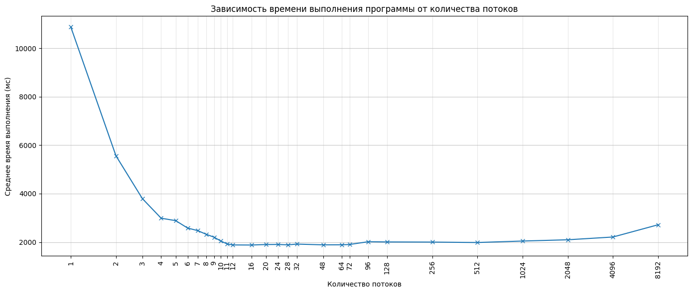
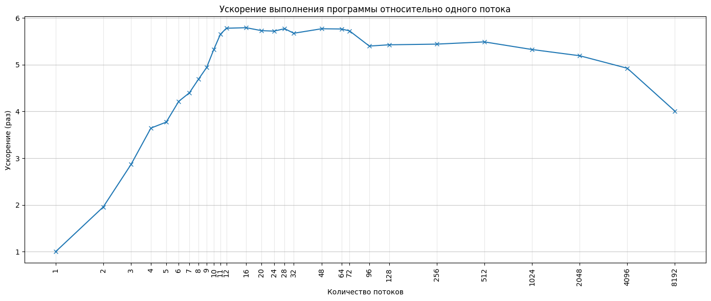
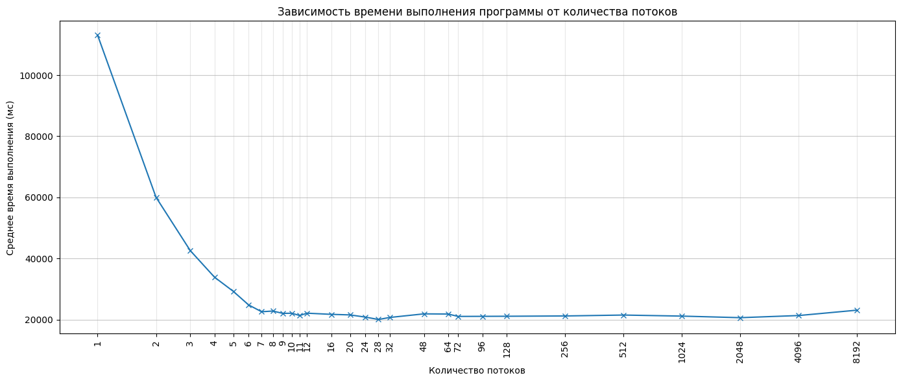
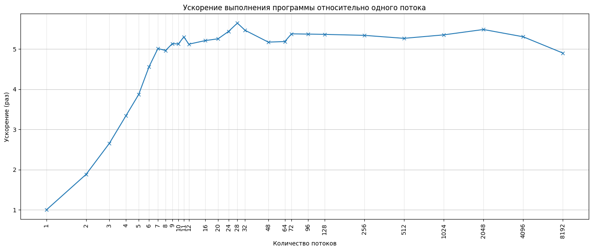
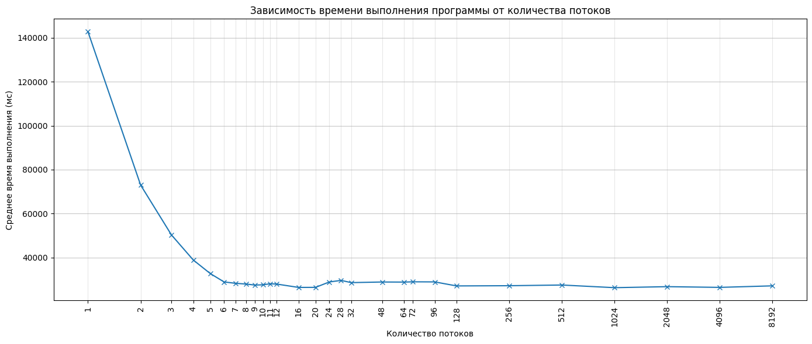
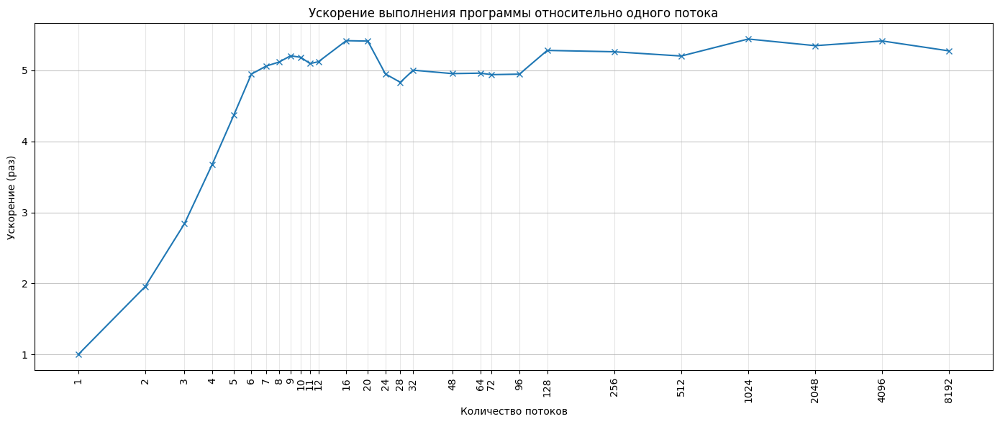

## Общее задание

Написать программу на одном из языков программирования *(С/ C++, C#, Java, Python, Golang)* с
использованием инструментов многопоточной обработки на базе CPU. 

Для выполнения работы нужно выбрать три разных видео файла *(каждый продолжительностью не менее 15 секунд)*, 
каждый содержит как минимум две сцены. Файлы должны отличаться длительностью и/ или размерами кадра видео для того,
чтобы оценить производительность алгоритма для разных объёмов данных. 
*(Например, можно взять три видео одного размера и продолжительностью 15, 30 и 60 секунд)*

## Индивидуальное задание

1. Загрузить видеофайл в виде массива кадров. 
2. Задать число $n$ – количество квантов на которые разобьются оттенки цветового канала (столбцов гис
тограммы распредел ения оттенков) $(4 \le n \le 10)$.
3. Для каждого кадра получить гистограммы распределения цветовых оттенков. 
Задать порог $T$ – положительное число, являющееся критерием определения незначительной разницы между кадрами видео.
*(Если расстояние между векторами, выражающих частотное распределение цветовых оттенков превышает порог $T$, 
то между кадрами есть разрыв в видео (два кадра принадлежат разным сценам), 
в противном случае кадры принадлежат одной сцене).}*
4. На каждый кадр добавить число – номер сцены. 
5. Результат сохранить в виде последовательности кадров с нумерацией сцены (видео, или набор изображений).

### Характеристики компьютера

Таблица 1. Характеристики операционной системы

| Параметр  | Значение   |
| --------- | ---------- |
| Семейство | Windows    |
| Издание   | 10 Pro     |
| Версия    | 22H2       |
| Сборка    | 19045.6456 |

Таблица 2. Характеристики оперативной памяти

| Параметр | Значение          |
| -------- | ----------------- |
| Тип      | DDR4 UDIMM        |
| Объем    | 32 ГБ (2 × 16 ГБ) |
| Частота  | 3200 МГц          |
| Тайминги | 16-20-20-40       |

Таблица 3. Характеристики процессора

| Параметр                      | Значение                             |
| ----------------------------- | ------------------------------------ |
| Модель                        | Intel Core i5-10400F                 |
| Сокет                         | LGA 1200                             |
| Ядра / потоки                 | 6 ядер, 12 потоков                   |
| Кэш                           | L1 – 384 КБ, L2 – 1,5 МБ, L3 – 12 МБ |
| Частота заявленная / реальная | 2.90 ГГц / 4.00 ГГц                  |
| Техпроцесс                    | 14 нм                                |
| Архитектура                   | Comet Lake-S                         |

### Результаты бенчмарка

#### Видеофайл 1

#### Видеофайл 2

#### Видеофайл 3

