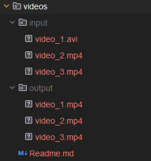

Привет! Эта папка на самом деле не должна быть пустой, чтобы код проекта можно было запустить - в ней должны содержатся исходники - видео, 
которые будут обрабатываться. Они слишком большие, поэтому их нет на гите, но папку можно скачать с ресурса:

https://drive.google.com/drive/folders/1h9w_am-ASWxTeMGZt2ce6iuI1QKmya3x?usp=sharing

Структура должна быть такой:

